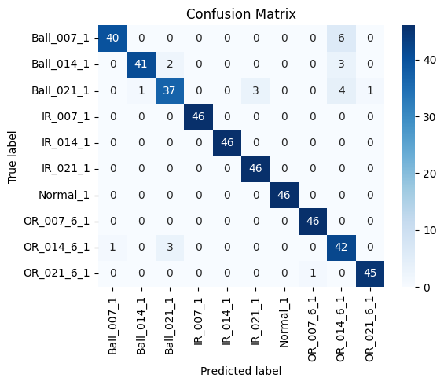
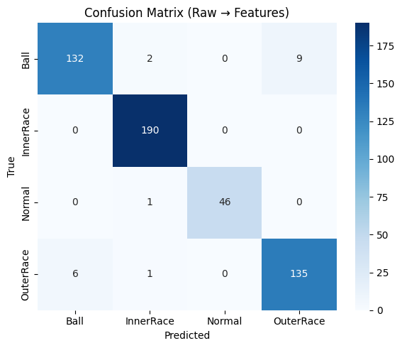
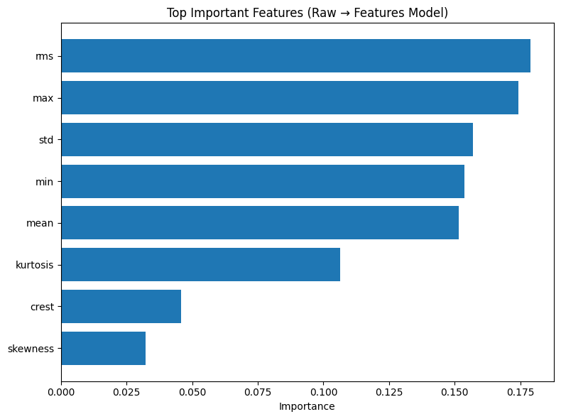

# Predictive Maintenance – Bearing Fault Detection  
### Raw Vibration + Feature-Based Machine Learning Pipelines

---

## 📌 Business Context

Unexpected failures in rotating machinery lead to costly downtime, safety risks, and production loss. Predictive maintenance enables early fault detection so components can be serviced before breakdowns occur—improving reliability and operational efficiency.

This project demonstrates a complete Predictive Maintenance solution covering:

1️⃣ **Raw Vibration Signal Processing Pipeline**  
Simulating real industrial sensor workflows

2️⃣ **Feature-Based Machine Learning Pipeline**  
Leveraging engineered vibration features for fast analytics

Together, they showcase the ability to:

✔ Work with real sensor data  
✔ Extract meaningful engineering features  
✔ Build machine learning diagnostics  
✔ Deliver actionable maintenance decisions  

---

## 🎯 Objectives

Classify bearing health conditions into:

- Normal (Healthy)
- Ball Fault
- Inner Race Fault
- Outer Race Fault

Handle multiple fault severities and loads  
Provide explainable + engineering-trustworthy outputs

---

## 🧠 Dataset Overview

### 🔶 Processed Feature Dataset
- Tabular vibration statistics
- One row = one vibration window
- Key features include:
  - RMS  
  - Standard Deviation  
  - Mean / Max / Min  
  - Skewness & Kurtosis  
  - Crest Factor  

### 🔷 Raw Vibration Data
- Accelerometer `.mat` recordings
- Continuous vibration signals
- Multiple operating loads
- Multiple fault severities

---

## 🧱 Solution Overview

### ✅ 1️⃣ Feature-Based Classification Pipeline (Analytical Approach)

Fast analytical ML when features are already available.

Steps  
- Load structured vibration feature dataset  
- Train Random Forest classifier  
- Evaluate  
- Explain results with feature importance  

Outcome  
Rapid and effective predictive maintenance decision-making.

---

### ✅ 2️⃣ Raw Signal Processing Pipeline (Industrial Approach)

Closer to real factory workflows.

Steps  
- Load `.mat` vibration files  
- Segment signals into windows  
- Extract statistical vibration features  
- Train Random Forest classifier  
- Evaluate + explainability  

Outcome  
Automated end-to-end digital maintenance capability from sensor → diagnosis.

---

# 📊 Model Evaluation & Visual Results

Both pipelines are evaluated using:

- Accuracy  
- Precision, Recall, F1  
- Confusion Matrix  
- Feature Importance

---

## ✅ Notebook 1 – Feature-Based Pipeline

### 🔷 Confusion Matrix
Excellent class separation and minimal misclassification.

### 🔷 Feature Importance
Highlights dominant diagnostic indicators.

**Key Insights**
- RMS is a strong indicator of energy change under fault
- Kurtosis identifies impulsive shocks → common in bearing defects
- Crest Factor helps separate impact-dominant faults
- Standard Deviation indicates instability and mechanical degradation

Result:  
**Highly accurate + stable model performance** with strong explainability.

---

## ✅ Notebook 2 – Raw Signal Pipeline

### 🔶 Confusion Matrix
Shows strong predictive performance even when starting from raw vibration signals.

### 🔶 Feature Importance
Shows similar dominant signals → confirming engineering consistency.

**Key Insights**
- RMS, Kurtosis, Std, Crest Factor again dominate
- Confirms pipeline robustness  
- Confirms alignment with vibration theory
- Model generalizes well despite additional signal processing steps

---

# 🔍 Comparative Analysis – Pipeline vs Pipeline

### 🎯 Accuracy & Classification
Both pipelines **achieve strong classification performance**, with the feature dataset pipeline achieving slightly more stable and consistent predictions due to cleaner inputs.

### 🧠 Interpretability
Both models agree that:
- **RMS**
- **Kurtosis**
- **Crest Factor**
- **Std Deviation**

are the most important indicators.  

This agreement strengthens engineering trust and validates feature engineering quality.

### ⚙️ Practical Industrial Meaning
- The **feature-based pipeline** is ideal when structured monitoring systems already exist.  
- The **raw signal pipeline** is suited for real-world IoT deployment, where the system must convert raw sensor data into insights.

---

# 🏁 Final Takeaways

✔ Both pipelines deliver **high diagnostic accuracy**  
✔ Models provide **clear, explainable engineering insights**  
✔ Evidence aligns strongly with vibration theory  
✔ Demonstrates robust predictive maintenance capability  
✔ Valid for real-world industrial deployment

---
