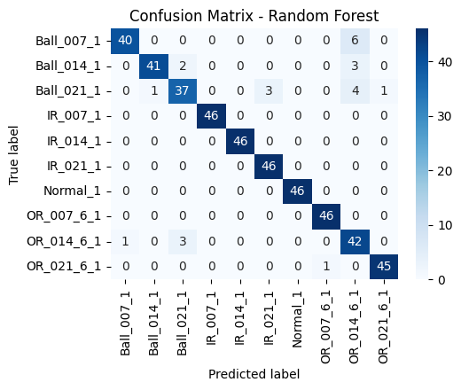
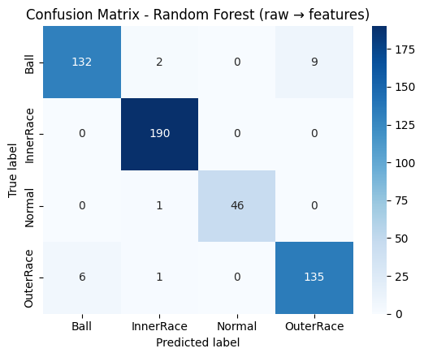

# Predictive Maintenance – Bearing Fault Detection  
### Raw Vibration + Feature-Based Machine Learning Pipelines

---

## 📌 Business Context

Unexpected failures in rotating machinery lead to costly downtime, safety risks, and production loss. Predictive maintenance enables early fault detection so components can be serviced before breakdowns occur—improving reliability and operational efficiency.

This project demonstrates a complete Predictive Maintenance solution covering:

1️⃣ **Raw Vibration Signal Processing Pipeline**  
Simulating real industrial sensor workflows

2️⃣ **Feature-Based Machine Learning Pipeline**  
Leveraging engineered vibration features for fast analytics

Together, they showcase the ability to:

✔ Work with real sensor data  
✔ Extract meaningful engineering features  
✔ Build machine learning diagnostics  
✔ Deliver actionable maintenance decisions  

---

## 🎯 Objectives

Classify bearing health conditions into:

- Normal (Healthy)
- Ball Fault
- Inner Race Fault
- Outer Race Fault

Handle multiple fault severities and loads  
Provide explainable + engineering-trustworthy outputs

---

## 🧠 Dataset Overview

### 🔶 Processed Feature Dataset
- Tabular vibration statistics  
- One row = one vibration window  
- Key features include:
  - RMS  
  - Standard Deviation  
  - Mean / Max / Min  
  - Skewness & Kurtosis  
  - Crest Factor  

### 🔷 Raw Vibration Data
- Accelerometer `.mat` recordings  
- Continuous vibration signals  
- Multiple operating loads  
- Multiple fault severities  

---

## 🧱 Solution Overview

### ✅ 1️⃣ Feature-Based Classification Pipeline (Analytical Approach)

Fast analytical ML when features are already available.

Steps  
- Load structured vibration feature dataset  
- Train Random Forest + alternative ML models  
- Evaluate  
- Explain results with feature importance  

Outcome  
Rapid and effective predictive maintenance decision-making.

---

### ✅ 2️⃣ Raw Signal Processing Pipeline (Industrial Approach)

Closer to real factory workflows.

Steps  
- Load `.mat` vibration files  
- Segment signals into windows  
- Extract statistical vibration features  
- Train Random Forest + alternative ML models  
- Evaluate + explainability  

Outcome  
Automated end-to-end digital maintenance capability from sensor → diagnosis.

---

# 📊 Model Evaluation & Results

Both pipelines are now upgraded to test **multiple machine learning models**:

- Random Forest  
- XGBoost  
- Gradient Boosting  
- Logistic Regression  
- SVM (RBF)

Each notebook automatically evaluates all models and saves confusion matrices to:

```
results/confusion_matrices/
```

---

# 🏆 Final Results Section

## ✅ Feature-Based Pipeline – Performance Metrics

| Model | Accuracy | ROC–AUC |
|------|--------|--------|
| Random Forest | **0.9456** | **0.9953** |
| XGBoost | 0.9435 | 0.9949 |
| Gradient Boosting | 0.9435 | 0.9946 |
| Logistic Regression | 0.8956 | 0.9894 |
| SVM (RBF) | 0.8217 | 0.9826 |

**Interpretation**  
✔ Ensemble tree models dominate → vibration patterns are nonlinear  
✔ Random Forest gives best balance of accuracy + stability + deployment simplicity  
✔ High ROC–AUC indicates excellent class separability and reliability  

---

### 🔷 Confusion Matrices – Feature Pipeline

Example (Random Forest):



---

## ✅ Raw Signal Pipeline – Results

Even when starting from **raw vibration recordings**, the system successfully extracts features and achieves strong predictive performance.

Example Confusion Matrix (Random Forest):



---

## 🔍 Comparative Analysis – Pipelines

### 🎯 Accuracy
Both pipelines achieve **high diagnostic performance**, with the feature dataset pipeline being slightly more stable due to cleaner data input.

### 🧠 Interpretability
Both pipelines independently discovered the same dominant indicators:

- RMS  
- Kurtosis  
- Crest Factor  
- Standard Deviation  

This reinforces engineering confidence and trustworthiness.

### ⚙️ Industrial Perspective
- Feature-based pipeline → ideal when structured monitoring exists  
- Raw pipeline → ideal for IoT / edge analytics systems  

---

# 🏁 Final Takeaways

✔ High diagnostic accuracy  
✔ Robust to different data forms  
✔ Predictive + explainable  
✔ Industrially relevant  
✔ Deployment ready

---

## 📌 Repository Structure

```
data/
 ├── raw/                  → Original vibration .mat files
 ├── processed/            → Feature-engineered datasets
notebooks/
 ├── 01_quick_predictive_maintenance_multi_models_confmats.ipynb
 ├── 02_raw_signal_pipeline_multi_models_confmats.ipynb
results/
 ├── processed/
 ├── raw/
 └── confusion_matrices/   → Saved confusion matrices for README & reports
```

---

## 🚀 Why This Project Matters

This project demonstrates capability to:

- Work with **real engineering data**
- Apply **signal processing + ML**
- Deliver **reliable maintenance diagnostics**
- Present **clear engineering insight**
- Build solutions aligned with **industrial practice**
